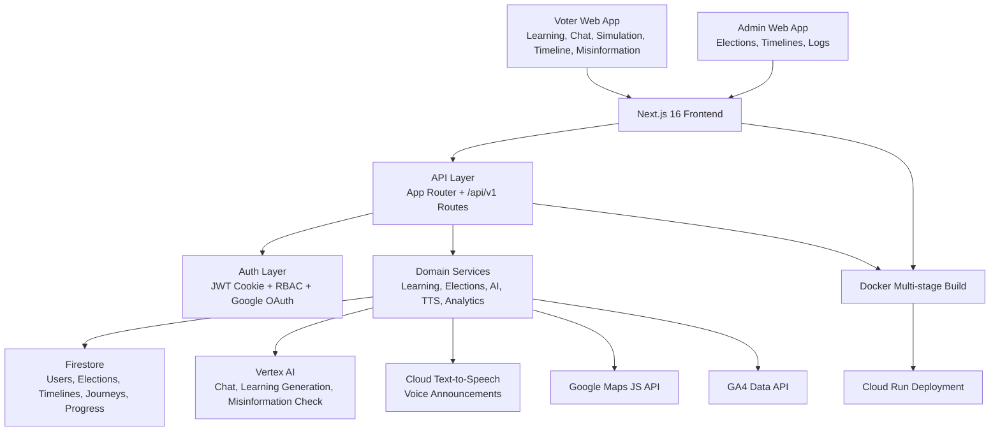

# VoteWise

Production-grade election process education platform powered by AI and built for civic engagement at scale.

VoteWise helps citizens understand elections, verify political information, and participate confidently — while giving administrators a secure control surface for managing election data and platform operations.

## Problem Statement

Design a solution that makes the democratic process clear, accessible, and trustworthy for every citizen — especially first-time voters and communities historically underserved by civic education.

At scale, election education needs to solve three things at once:

1. Deliver accurate, unbiased information about election mechanics to citizens on demand.
2. Help users identify and reject political misinformation before it influences decisions.
3. Make civic participation accessible to everyone, regardless of language, ability, or prior knowledge.

## Why Existing Solutions Fail

Most civic education tools still rely on fragmented, static resources:

1. Government websites are dense and difficult to navigate without existing knowledge.
2. Misinformation spreads faster than fact-checkers can respond manually.
3. Voter preparation tools are not personalized and do not adapt to the user's knowledge level.
4. Accessibility is an afterthought — screen reader support and multilingual content are rarely production-grade.
5. No interactive practice exists for the actual voting experience before election day.

The result is voter apathy, disenfranchisement, and an electorate vulnerable to manipulation.

## Our Solution

VoteWise unifies personalized civic education and AI-assisted fact-checking in one accessible, mobile-first web platform.

The platform combines:

1. AI-generated personalized learning journeys that adapt to the user's pace and knowledge level.
2. An interactive voting simulation that familiarizes users with the real ballot experience.
3. A real-time misinformation detector that cross-references user-submitted claims against verified facts.
4. A conversational AI civic educator available 24/7 to answer nuanced election questions.
5. Google Cloud AI workflows for content generation, chat, voice, and fact analysis.
6. Security-by-default authentication and role-based access control for all protected operations.

This creates a shared, trustworthy civic knowledge layer accessible to voters, educators, and administrators alike.

## Key Features

### Voter Experience

1. Personalized learning journeys generated by Vertex AI and tailored to each user's knowledge level.
2. Interactive voting simulation with step-by-step ballot experience to reduce first-time voter anxiety.
3. Election Timeline Explorer with interactive chronological views of past and upcoming election events.
4. AI-powered Misinformation Detector to flag and explain potentially false political claims.
5. Conversational AI chat assistant for nuanced, on-demand answers to election-specific questions.
6. Multi-language support and text-to-speech voice options for broad accessibility.
7. User profile with customizable preferences and authenticated account context.
8. Progress tracking across learning modules with persistent state.

### Admin Operations

1. Protected admin console at `/admin` for ADMIN role holders.
2. Full CRUD management for election records, timelines, and civic data.
3. System log review for monitoring platform health and user activity.
4. Google Cloud Text-to-Speech generation for accessible civic announcements.
5. Vertex AI-backed content generation for election timelines and learning paths.
6. Safe fallback responses when cloud AI is degraded or unavailable.

### Platform Engineering and UX

1. Next.js 16 App Router architecture with TypeScript throughout.
2. Firestore-backed repositories for users, elections, timelines, learning journeys, and progress.
3. Intelligent in-memory fallback when Firestore is unavailable in local/dev environments.
4. Zustand + TanStack Query for robust client state management and server-state caching.
5. Zod schema validation on all API payloads and environment configuration.
6. WCAG 2.2-compliant UI with axe-core validated accessibility across all core routes.
7. Role-aware navigation with route-level access behavior enforced server-side.
8. Docker multi-stage build with Next.js standalone output for lean production images.

## Google Services Used

| Google Service                  | Usage in VoteWise                                                          |
| ------------------------------- | -------------------------------------------------------------------------- |
| Google OAuth 2.0                | User authentication via Google sign-in (Auth.js / NextAuth integration)    |
| Google Cloud Firestore          | Primary managed data store for users, elections, timelines, learning data  |
| Google Vertex AI (Gemini)       | AI chat, personalized learning journey generation, misinformation analysis |
| Google Cloud Text-to-Speech     | Accessible civic announcements and voice preference support                |
| Google Analytics Data API (GA4) | Platform usage analytics for admin overview metrics                        |
| Google Maps JavaScript API      | Geographic context for election district and polling location features     |
| google-auth-library / ADC       | Server-side access token management for all Google Cloud API calls         |
| Google Cloud Run                | Target runtime for scalable containerized production deployment            |

## Architecture Diagram



## Scalability & Security

### Scalability

1. Stateless JWT session model supports horizontal scaling without sticky sessions.
2. Firestore provides managed, auto-scaling storage for high-read civic data workloads.
3. In-memory repository fallback ensures local and CI environments work without cloud dependencies.
4. TanStack Query caching reduces redundant API calls and improves perceived performance.
5. Next.js standalone build plus Docker multi-stage image keeps production images lean and fast.
6. Cloud Run-ready architecture enables on-demand burst handling for election-day traffic spikes.

### Security

1. HttpOnly session cookies with SameSite and Secure-in-production enforcement.
2. JWT signing and verification with strict role claim validation using `jose`.
3. Role-based access control — ADMIN-only routes protected server-side and in middleware.
4. Password hashing with bcrypt at cost factor 12 for all credential-based accounts.
5. Zod schema validation on every auth, user, and admin API payload to reject malformed input.
6. OAuth callback sanitization with controlled redirect behavior to prevent open-redirect attacks.
7. Admin email allowlist (`ADMIN_EMAIL_ALLOWLIST`) to restrict privilege escalation at registration.
8. Server-only Google API access patterns — no cloud credentials exposed to the client.
9. Environment variable validation at startup to fail fast on misconfiguration before serving traffic.

### Reliability, Testing, and Production Readiness

1. Jest-based unit tests covering auth utilities, repository logic, and edge cases for fast CI feedback.
2. End-to-end Playwright suite across Chromium, Firefox, and WebKit browsers.
3. Page Object Model (POM) architecture for maintainable, scalable E2E test authoring.
4. E2E coverage for login, dashboard, learning, timeline, chat, misinformation detector, and voting simulation.
5. Deterministic API mocking for Vertex AI, TTS, and auth endpoints to eliminate flaky network tests.
6. Retry, trace, screenshot, and video capture configured for dependable CI diagnostics.
7. Defensive API and UI fallback states for all degraded external dependencies.
8. WCAG 2.2 accessibility hardening validated with axe-core scans across core routes.
9. Lighthouse accessibility score of 100 on key routes.
10. ESLint + Prettier enforced in CI for consistent code quality and style across the codebase.

## Product Routes

| Route             | Purpose                                           | Access        |
| ----------------- | ------------------------------------------------- | ------------- |
| /                 | Product overview and call-to-action landing       | Public        |
| /login, /register | Auth lifecycle pages                              | Public        |
| /dashboard        | Personalized voter hub and navigation entry point | Public        |
| /learning         | Personalized learning journey viewer              | Public        |
| /timeline         | Interactive election event timeline               | Public        |
| /chat             | AI civic educator chat assistant                  | Authenticated |
| /simulation       | Step-by-step voting booth simulation              | Public        |
| /misinformation   | AI-powered political claim fact-checker           | Public        |
| /profile          | User identity, preferences, and progress          | Authenticated |
| /admin            | Admin control panel                               | Admin only    |
| /admin/elections  | Election record management                        | Admin only    |
| /admin/timelines  | Timeline event management                         | Admin only    |
| /admin/logs       | System activity log review                        | Admin only    |

## API Snapshot

| Endpoint                            | Method                | Purpose                                     | Access        |
| ----------------------------------- | --------------------- | ------------------------------------------- | ------------- |
| /api/auth/me                        | GET                   | Resolve session state and current user role | Public        |
| /api/auth/google                    | GET                   | Initiate Google OAuth flow                  | Public        |
| /api/auth/google/callback           | GET                   | Complete OAuth exchange and create session  | Public        |
| /api/v1/users/me                    | GET                   | Get authenticated user profile              | Authenticated |
| /api/v1/users/profile               | PATCH                 | Update user preferences                     | Authenticated |
| /api/v1/elections                   | GET                   | List all elections                          | Public        |
| /api/v1/elections/:electionId       | GET                   | Get single election record                  | Public        |
| /api/v1/timelines/:electionId       | GET                   | Get election timeline events                | Public        |
| /api/v1/timelines/:electionId/:id   | GET                   | Get single timeline event                   | Public        |
| /api/v1/learning-journey            | GET                   | List user learning journeys                 | Authenticated |
| /api/v1/learning-journey/generate   | POST                  | Generate AI personalized learning journey   | Public        |
| /api/v1/learning-journey/:journeyId | GET                   | Get single journey                          | Authenticated |
| /api/v1/progress                    | GET                   | Get user learning progress                  | Authenticated |
| /api/v1/progress/update             | POST                  | Update user progress state                  | Authenticated |
| /api/v1/simulation/start            | POST                  | Initialize voting simulation session        | Public        |
| /api/v1/simulation/step             | POST                  | Advance simulation to next step             | Public        |
| /api/v1/ai/chat/ask                 | POST                  | Generate AI civic educator chat response    | Public        |
| /api/v1/ai/misinformation/check     | POST                  | Analyze political claim for misinformation  | Public        |
| /api/v1/ai/learning/generate        | POST                  | Generate AI learning path content           | Public        |
| /api/v1/ai/timeline/generate        | POST                  | Generate AI election timeline summary       | Public        |
| /api/v1/admin/elections             | GET/POST/PATCH/DELETE | Full election CRUD                          | Admin only    |
| /api/v1/admin/timelines             | GET/POST/PATCH/DELETE | Full timeline CRUD                          | Admin only    |
| /api/v1/admin/logs                  | GET                   | Read system activity logs                   | Admin only    |

## Tech Stack

| Layer        | Technology                                                       |
| ------------ | ---------------------------------------------------------------- |
| Frontend     | Next.js 16, React 19, TypeScript                                 |
| UI           | Tailwind CSS v4, shadcn/ui, Radix UI Primitives                  |
| State & Data | Zustand, TanStack React Query                                    |
| Data Layer   | Google Cloud Firestore (firebase-admin) + in-memory fallback     |
| Auth         | Auth.js (NextAuth v5 beta), Google OAuth, JWT (HttpOnly cookies) |
| Validation   | Zod v4                                                           |
| AI           | Google Vertex AI — Gemini 2.5 Flash (@google/genai)              |
| Voice        | Google Cloud Text-to-Speech                                      |
| Analytics    | Google Analytics Data API (GA4)                                  |
| Maps         | Google Maps JavaScript API                                       |
| Forms        | React Hook Form + Zod resolvers                                  |
| Testing      | Playwright (E2E + POM), Jest (Unit)                              |
| Linting      | ESLint (Next.js config), Prettier                                |
| Deployment   | Docker multi-stage, Google Cloud Run                             |

## Getting Started

### Prerequisites

1. Node.js 20+
2. npm 10+
3. Google Cloud project with Firestore enabled

### Install

```bash
npm install
```

### Configure Environment

macOS/Linux:

```bash
cp .env.example .env.local
```

Windows PowerShell:

```powershell
Copy-Item .env.example .env
```

### Run Locally

```bash
npm run dev
```

Open http://localhost:3000.

## Environment Variables

| Variable                        | Required | Purpose                                          |
| ------------------------------- | -------- | ------------------------------------------------ |
| GOOGLE_CLOUD_PROJECT            | Yes      | Google Cloud project context                     |
| GOOGLE_CLOUD_PROJECT_ID         | Yes      | Backwards-compatible alias for project context   |
| AUTH_JWT_SECRET                 | Yes      | JWT signing secret for session tokens            |
| AUTH_COOKIE_NAME                | Optional | Session cookie name override                     |
| GOOGLE_OAUTH_CLIENT_ID          | Yes      | Google OAuth client ID                           |
| GOOGLE_OAUTH_CLIENT_SECRET      | Yes      | Google OAuth client secret                       |
| GOOGLE_OAUTH_CALLBACK_URL       | Yes      | OAuth callback URL                               |
| ADMIN_EMAIL_ALLOWLIST           | Yes      | Comma-separated list of admin-privileged emails  |
| NEXT_PUBLIC_GOOGLE_MAPS_API_KEY | Optional | Client-side Google Maps rendering                |
| GOOGLE_ANALYTICS_PROPERTY_ID    | Yes      | GA4 property ID for analytics endpoint           |
| GOOGLE_GENAI_USE_VERTEXAI       | Optional | Set to `true` to route GenAI calls via Vertex AI |
| GOOGLE_CLOUD_LOCATION           | Yes      | Vertex AI region (e.g. `us-central1`)            |
| GOOGLE_VERTEX_MODEL             | Yes      | Vertex model name (e.g. `gemini-2.5-flash`)      |
| GOOGLE_API_KEY                  | Optional | Gemini API key fallback for local dev            |
| GEMINI_API_KEY                  | Optional | Alias for GOOGLE_API_KEY                         |
| GOOGLE_TTS_LANGUAGE_CODE        | Yes      | Default TTS language (e.g. `en-IN`)              |
| GOOGLE_TTS_VOICE_NAME           | Yes      | Default TTS voice name                           |
| FIRESTORE_PROJECT_ID            | Optional | Firestore project override                       |
| FIRESTORE_DATABASE_ID           | Optional | Firestore database override                      |
| GOOGLE_APPLICATION_CREDENTIALS  | Optional | Local ADC credential file path                   |

## Available Scripts

1. `npm run dev`: Start development server.
2. `npm run build`: Build production bundle.
3. `npm run start`: Start production server.
4. `npm run lint`: Run ESLint across the codebase.
5. `npm run format`: Auto-format all files with Prettier.
6. `npm run format:check`: Check formatting without writing changes.

## Testing

VoteWise maintains a comprehensive, production-ready testing suite covering four distinct testing layers to ensure reliability:

1. **Unit Testing (Jest):** Tests isolated functions, utilities, and components (e.g., auth logic, validation schemas, formatters).
2. **Integration Testing (Jest):** Tests interactions between internal modules, database repositories, and service layers using mocked dependencies where necessary.
3. **API Testing (Playwright):** Tests Next.js API route endpoints directly to ensure correct HTTP status codes, JSON payload structures, and authorization barriers.
4. **End-to-End (E2E) Testing (Playwright):** Simulates real user browser flows (Login, Dashboard, Learning, AI Chat, Voting Simulation) across Chromium, Firefox, and WebKit.

### Running Tests

Run all tests across all layers:
```bash
npm run test:all
```

Run specific testing layers:
```bash
npm run test:unit         # Run Unit tests via Jest
npm run test:integration  # Run Integration tests via Jest
npm run test:api          # Run API endpoint tests via Playwright
npm run test:e2e          # Run E2E browser tests via Playwright
```

### Playwright E2E Options

Run E2E tests in headed mode (visible browser):
```bash
npm run test:e2e:headed
```

Open Playwright interactive UI runner:
```bash
npm run test:e2e:ui
```

Debug a specific test:
```bash
npm run test:e2e:debug
```

Open Playwright HTML report:
```bash
npm run test:e2e:report
```

Current automated suites validate:

1. Home page rendering, CTA navigation, and public route accessibility.
2. Login form validation, error states, and successful authenticated session setup.
3. Dashboard layout, learning path entry points, and protected route behavior.
4. Timeline explorer rendering and event navigation.
5. AI chat assistant input, response rendering, and error fallback states.
6. Misinformation detector claim submission, AI response display, and network failure handling.
7. Voting simulation step-by-step flow, state transitions, and completion state.
8. API endpoints for correct HTTP responses and payload structures.
9. Page Object Model (POM) layer for all core feature surfaces, ensuring maintainable test authoring.

## Summary

VoteWise delivers a complete, secure, and production-ready election education platform: AI-personalized civic learning and interactive voting preparation for voters, real-time misinformation detection for informed citizens, and a robust administrative control surface for platform operators — all underpinned by Google Cloud infrastructure, WCAG 2.2 accessibility compliance, and a comprehensive automated test suite built for production confidence.
